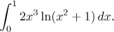
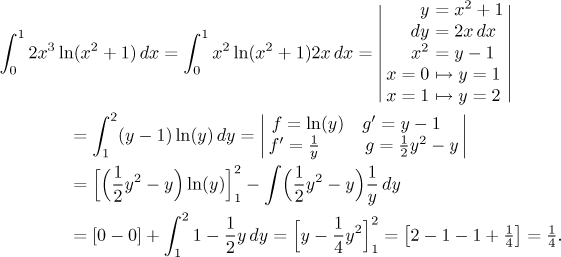

# goit-algo-hw-10

Завдання 2:

Для виконання завдання було обрано такий інтеграл:

Аналітичне вирішення даного інтегралу буде таким:

Результат виконання коду:

Теоретична площа під графіком (with quad): 0.25  
Середня площа під графіком за 100 експериментів: 0.24933243441733832

Висновок: при округленні до двох знаків після коми всі методи показали однакові результати, а отже у випадку інтегралу складного для аналітичного обчислення метод Монте - Карло можна використовувати. А при збільшенні кількості рандомних точок та кількості експериментів можна отримати ще більш точний результат.